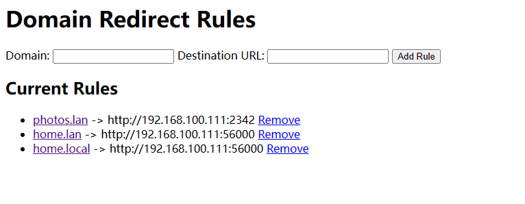
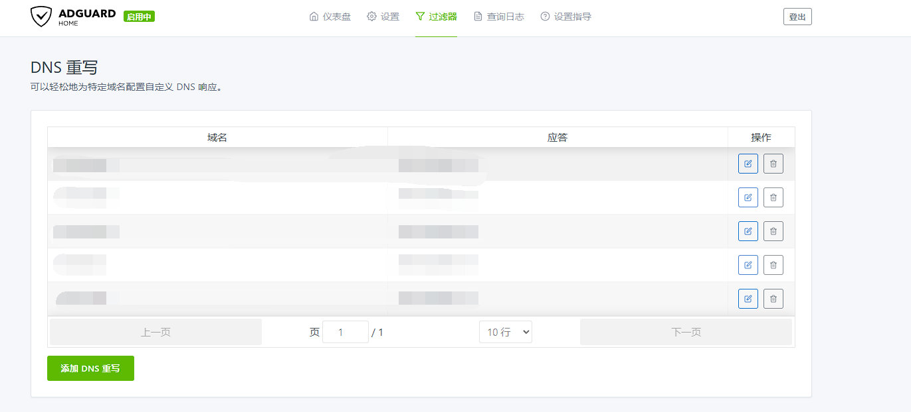

# 服务重定向器

适用于家庭局域网的服务重定向器。

面向的场景：

- NAS服务端口过多，记忆不过来
- 即使设置了自定义的DNS解析器来重写家庭域名，比如openwrt.lan，但是只对80端口比较友好，其他端口仍然需要添加端口号来访问（无法解决根本问题）

本项目旨在通过一个超轻量级的转发来达到家庭域名直达服务的目的。原理很简单，类似于nginx基于域名重定向的方法：



根据访问域名的不同来进行重定向到不同的服务器URL上

可以配合上比如AdguardHome域名重写，或者dnsmasq的域名挟持功能：



访问过程如下:

本地域名 --> DNS重写 --> 重定向器主机80端口 --> 重定向器重定向 --> 服务真实URL

建议将重定向器直接部署在80端口

## Docker 部署

```sh
$ docker-compose up -d
```

